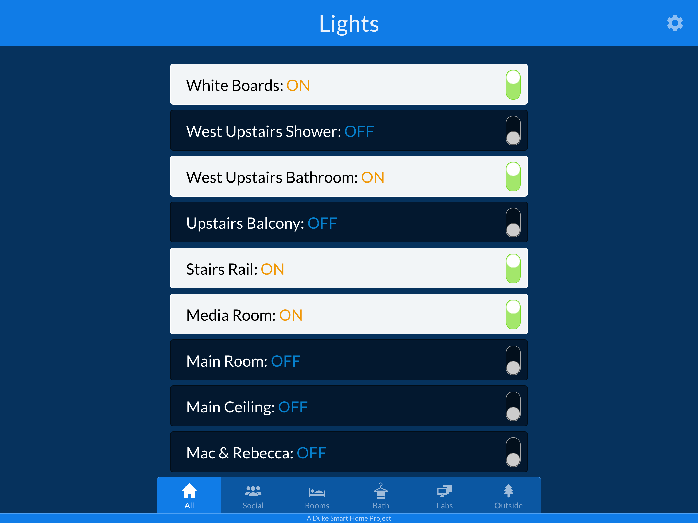
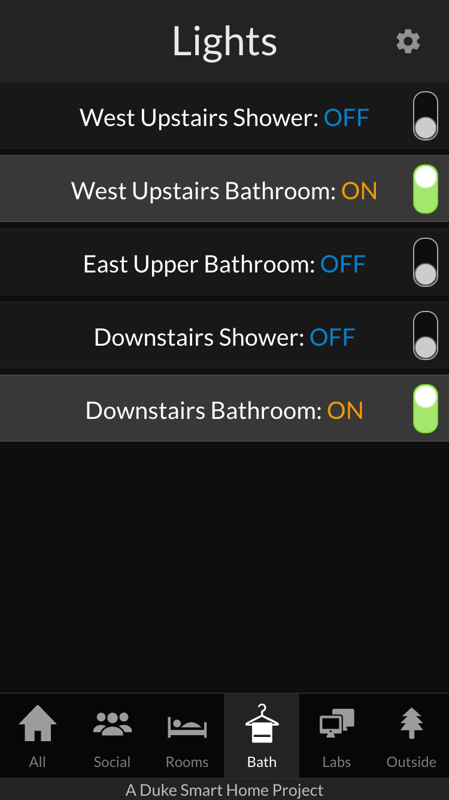

# Smart Home Lighting App

## Usage
- to run the lighting server, you will first need to install [Node.js](https://nodejs.org/en/)
- to develop with the app:
    - `$ npm install` to install all dependencies
    - `$ npm run backend` to test/develop for the Node.js backend
    - `$ npm run frontend` to test/develop for the React frontend

- for serving in production:
    - `$ npm run build` to build the frontend into a [static site](https://en.wikipedia.org/wiki/Static_web_page)
    - use a process manager such as [pm2](http://pm2.keymetrics.io/) to serve the app
    - with pm2:
        - `$ npm install pm2 -g`
        - `$ pm2 start app.js`

## Features

__Version 2.0__ (Fall 2018):
- live status of the lights
- dark mode
- a refreshed UI
- under-the-hood updates to React and ES6

__Version 1.0__ (Spring 2016):
- Written for [Node.js](https://nodejs.org/en/)
- Uses [socket.io](https://socket.io/) for real-time updates
- Responsive frontend interface
- Integrated with the CLIPSAL lighting controllers in the Duke Smart Home
    - Uses the CLISPAL [C-Bus Serial Interface](http://training.clipsal.com/downloads/OpenCBus/OpenCBusProtocolDownloads.html)