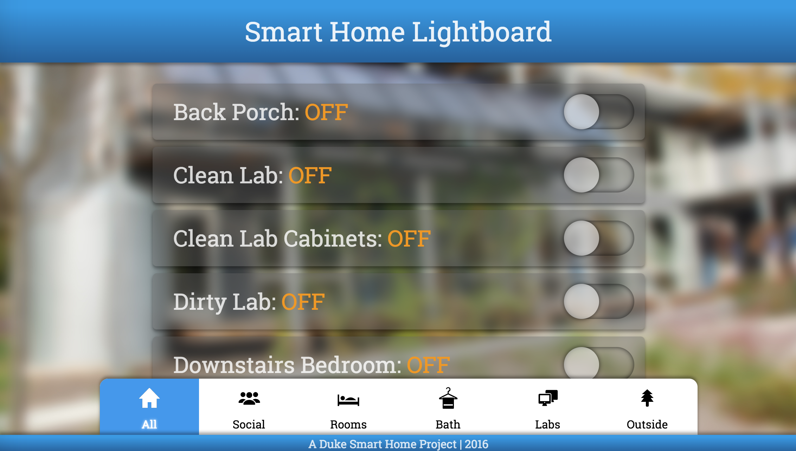

# Smart Home Lighting App

Developed by Harvey Shi (@rvshi) in spring 2016, with help from Lauren Shum, Patrick Grady, and Suyash Kumar.

- Written for [Node.js](https://nodejs.org/en/)
- Uses [socket.io](https://socket.io/) for real-time updates
- Responsive frontend interface
- Integrated with the CLIPSAL lighting controllers in the Duke Smart Home
    - Uses the CLISPAL [C-Bus Serial Interface](http://training.clipsal.com/downloads/OpenCBus/OpenCBusProtocolDownloads.html)